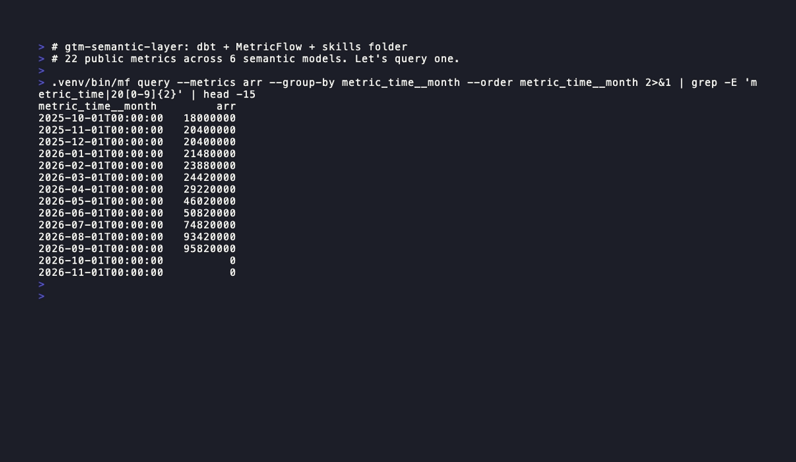
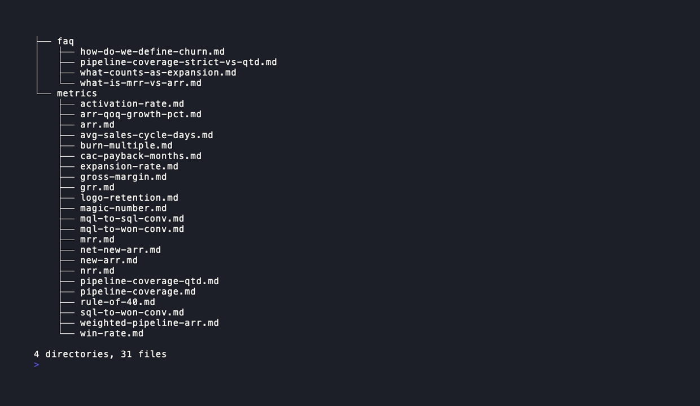

# gtm-semantic-layer

Governed, self-service GTM analytics stack. dbt-core + MetricFlow + DuckDB/Snowflake + a versioned `skills/` folder consumed by Claude-style assistants.


## What this is

A reconstructed, runnable GTM warehouse: 23 public metrics across 7 semantic models, column-level PII tags that propagate from source YAML through the manifest and get enforced in CI, and a `skills/` markdown folder that lets an LLM assistant pick the right metric and emit a deterministic MetricFlow query instead of hallucinating SQL. The point is not another dbt project, it is the governance surface around it: tagged columns, singular reconciliation tests, a skill-to-metric crosswalk the build fails on, and a freshness check so stale metric docs cannot ship. Built solo against open sources (dbt-labs canonical layering, standard GTM formulas) as a sincere reconstruction of a published pattern.

## Run locally (90 seconds)

```bash
git clone https://github.com/JayDS22/gtm-semantic-layer
cd gtm-semantic-layer
make up        # pip install, dbt deps/seed/build, mf validate-configs
make q METRIC=arr GROUP=metric_time__month
```

Requires Python 3.11+. No cloud credentials needed, DuckDB is the default target.

## Architecture

Seeds → staging (PII-tagged, source-tested) → intermediate (incremental MRR daily, account hierarchy reconciliation, cohort builder) → marts (dims + facts) → semantic layer (MetricFlow YAML) → `skills/` markdown consumed by an LLM router. See [`docs/architecture.md`](docs/architecture.md) for the Mermaid diagram, [`docs/metric-glossary.md`](docs/metric-glossary.md) for all 23 metrics with formulas and confidence tiers, [`docs/skills-pattern.md`](docs/skills-pattern.md) for the skills folder convention, and [`docs/example-trace.md`](docs/example-trace.md) for a Slack-shaped user question walked end-to-end: skill selection → `mf query` → answer.

## What's inside

| Layer | What's here |
|---|---|
| `seeds/gtm/` | 8 realistic GTM seeds (SFDC + Stripe + product events + quotas + financials) |
| `models/staging/` | 6 staging models, PII tags, source tests |
| `models/intermediate/` | 7 ints incl. `int_subscription_mrr_daily` (incremental + merge), `int_account_arr_monthly`, `int_account_cohort`, `int_account_hierarchy_reconciliation` (hierarchy-detector adversarial mod) |
| `models/marts/core/` | 5 dims + 7 facts incl. `fct_mrr_movement`, `fct_cohort_arr_monthly`, `fct_arr_qoq_growth`, `fct_opportunity`, `fct_funnel_event`, `fct_financials`, `fct_quota` |
| `models/semantic/` | 7 semantic models, 23 public metrics + ~30 supporting |
| `skills/` | 23 metric files + 3 debug runbooks + 4 FAQs, each with frontmatter |
| `scripts/` | `pii_check.py` (manifest walker), `skill_metric_crosswalk.py`, `skill_freshness.py` |
| `tests/singular/` | account-hierarchy reconciliation, subscription-period overlap, MRR-movement reconciliation, ARR↔billed reconciliation (adversarial-pass mod), NRR cohort denom nonzero |

## Metric domains

- **Revenue** (7): `arr`, `mrr`, `new_arr`, `net_new_arr`, `grr`, `nrr`, `arr_qoq_annualized_growth_pct`
- **Pipeline** (5): `pipeline_coverage`, `pipeline_coverage_qtd`, `win_rate`, `avg_sales_cycle_days`, `weighted_pipeline_arr`
- **Funnel** (4): `mql_to_sql_conv`, `sql_to_won_conv`, `mql_to_won_conv`, `activation_rate`
- **Retention** (2): `expansion_rate`, `logo_retention`
- **Efficiency** (5): `cac_payback_months`, `magic_number`, `burn_multiple`, `gross_margin`, `rule_of_40`

Full table with grain, formula, dimensions, and `confidence_tier` in [`docs/metric-glossary.md`](docs/metric-glossary.md). Honest tiers after Day 6: `cac_payback_months` and `rule_of_40` both lifted to `stable` (segment-weighted CAC denominator with real new_arr by segment; Rule-of-40 now carries both growth + margin terms). The 3 funnel conversions remain `evolving` (same-period proxy aggregation, true per-user cohort tracking is Day 7+).

## Walkthrough


Scripted terminal demo rendered via [charmbracelet/vhs](https://github.com/charmbracelet/vhs) from `.vhs/demo.tape`. No live recording; re-render after any user-facing change with `vhs .vhs/demo.tape`.

Static captures (same source, individual frames):


`mf query --metrics arr --group-by metric_time__month` returning ARR by month from the live DuckDB warehouse.


`tree skills/` showing the 23 metric files + 3 debug runbooks + 4 FAQs under their standard categories.

CI status: the green badge at the top of this README is live from GitHub Actions on the `main` branch.

## Status

- [x] Day 1, Skeleton, seeds, staging, source YAML, CI green
- [x] Day 2, Marts + first 5 metrics
- [x] Day 3, Remaining 15 metrics + skills folder + CI crosswalk
- [x] Day 4, PII enforcement + 4 singular tests + skill freshness + docs
- [x] Day 5, segment-weighted CAC payback (stable), demo GIF via vhs, screenshots, repo public
- [x] Day 6, Rule-of-40 growth term (stable), pii_check + skill_freshness CI gates flipped to blocking
- [ ] Day 7+, resume + application link, SCD2 opportunity snapshot, YoY growth once >= 5 quarters of history

## Attribution

The `skills/` folder pattern and column-level PII taxonomy are a sincere reconstruction from Anthropic's June 2026 post *How Anthropic enables self-service data analytics with Claude* (Chen Chang et al.); the architecture here is a reconstruction of the published pattern, not a copy of unpublished internals. Metric definitions, warehouse schema, dbt macros, singular tests, and CI are mine, written against open sources (dbt-labs canonical layering, standard GTM metric formulas). The repo was originally named `anthropic-gtm-semantic-layer` and renamed to `gtm-semantic-layer` for portability, the pattern applies to any data-forward org, not just one.

## Design doc and build log

Day-by-day progress in [`BUILD-LOG.md`](BUILD-LOG.md). The project was built from a 4-day design spec with adversarial self-review in the parent workspace (`_designs/03-anthropic-gtm-semantic-layer.md`); the adversarial mods are explicitly folded in: incremental + merge strategy on `int_subscription_mrr_daily`, `int_account_hierarchy_reconciliation` as a hierarchy-detector probe, `pipeline_coverage_qtd` as a sibling metric, and the ARR↔billed reconciliation singular test.
