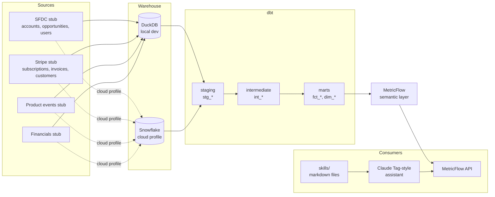

# Architecture

## Layering convention

The dbt project follows strict three-layer discipline, configured in
`dbt_project.yml`:

- **`models/staging/stg_*`**, one model per raw source table. 1:1 with
  the source, no joins. Column renames, type casts, and PII tagging only.
  Materialized as views so staging stays cheap.
- **`models/intermediate/int_*`**, ephemeral by default, so they vanish
  into their callers at compile time and don't clutter the warehouse.
  The one exception is `int_subscription_mrr_daily`, which is incremental
  because recomputing per-subscription daily MRR from the start of time
  is wasteful on every run.
- **`models/marts/core/fct_*` and `dim_*`**, materialized as tables.
  Facts carry grain-asserting singular tests (via the `test_assert_grain`
  macro); dimensions enforce PII drops (see `dim_user.sql`).

## Local vs cloud path

Local development runs against DuckDB, a single file, zero setup,
`dbt build` in seconds. Seeds load into `main.raw_*`, models land in
`main.analytics_*`. The cloud path is Snowflake, selected via the
`cloud` profile in `profiles.yml.example`. Model code is portable: the
`generate_schema_name` macro and the `cents_to_dollars` macro both
compile identically on either engine. The only engine-specific concern
is incremental merge syntax, and `int_subscription_mrr_daily` uses
`merge` which both engines support natively.

## The semantic layer sits on marts

MetricFlow is configured in `models/semantic/*.yml`, six semantic
models (`mrr_movement`, `opportunity`, `cohort_arr`, `funnel_event`,
`financials`, `quota`) each pointing at exactly one `fct_*` mart.
MetricFlow is the ONLY abstraction consumers see. Dashboards call
`mf query`, not SQL. The assistant calls `mf query`, not SQL. A
column rename in `fct_mrr_movement` is contained in one semantic model
file; no consumer breaks. This is the governance payoff.

## Skills folder: governed language for LLMs

The `skills/` folder is the layer that makes LLM-driven self-service
safe. It is a versioned, reviewer-approved vocabulary: one page per
public metric with formula, dimensions, and the exact `mf query` to
run; one page per common debug pattern; one page per FAQ. The CI check
`scripts/skill_metric_crosswalk.py` enforces that every skill file
resolves to a real MetricFlow metric, so skills cannot drift from the
semantic layer. The assistant loads the relevant pages into context
before answering, which is cheaper and more auditable than fine-tuning
and makes every answer traceable to a specific markdown file a human
reviewed last week.
